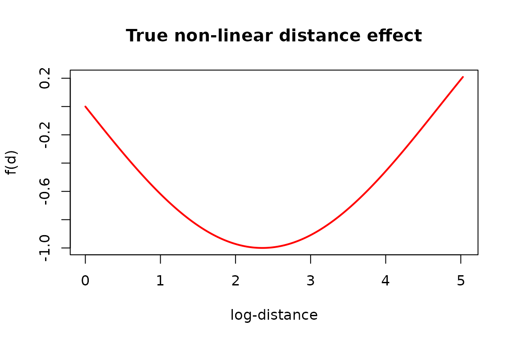
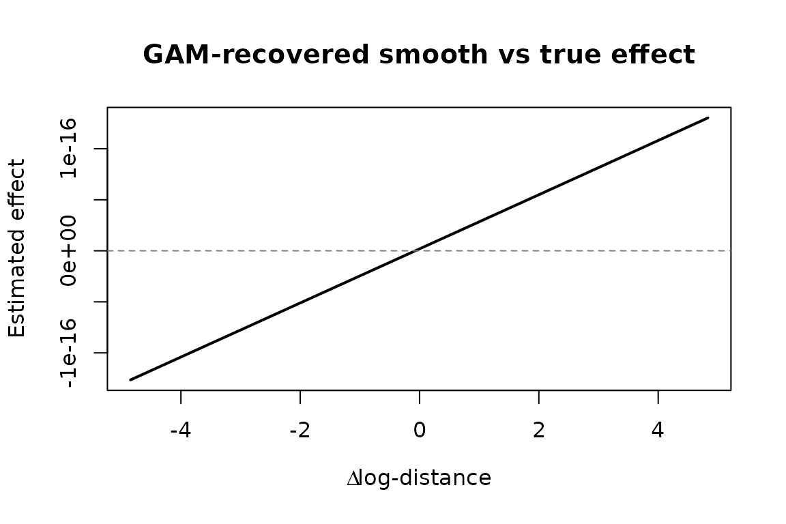

# Exogenous dyadic covariates

``` r
library(amore)
```

Exogenous information — such as geographic distance between actors — can
drive the rate at which relational events occur. `amore` supports this
through the `baseline_logits` argument of
[`simulate_relational_events()`](https://franciscorichter.github.io/amore/reference/simulate_relational_events.md),
which accepts any sender × receiver matrix of log-intensities.

## US state distance matrix

The package ships a 56 × 56 distance matrix (in metres) between US
states and territories. We load it and transform to a log-scale:

``` r
data("dist_matrix", package = "amore")

# log-transform to compress the range
dist_log <- log(dist_matrix / 100000 + 1)
```

## Defining a non-linear effect

Following the issue description, the true effect of distance on the
log-rate is a smooth, non-linear function:

$$f(d) = \sin\!( - d/1.5)$$

where $d$ is the log-transformed distance.

``` r
true_effect <- sin(-dist_log / 1.5)
```

We can visualise this curve:

``` r
d_seq <- seq(0, max(dist_log), length.out = 200)
plot(d_seq, sin(-d_seq / 1.5),
    type = "l", lwd = 2, col = "red",
    xlab = "log-distance", ylab = "f(d)",
    main = "True non-linear distance effect"
)
```



## Simulating events with exogenous covariates

We pass the effect matrix directly as `baseline_logits`. The Gillespie
algorithm uses these values to weight which dyad fires next. We also
request one control per event for downstream inference:

``` r
set.seed(42)

states <- rownames(dist_matrix)

events <- simulate_relational_events(
    n_events        = 800,
    senders         = states,
    receivers       = states,
    baseline_logits = true_effect,
    allow_loops     = FALSE,
    n_controls      = 1
)

head(events)
#>   stratum event               sender     receiver         time
#> 1       1     1                Texas     Maryland 0.0001203087
#> 2       1     0       North Carolina Pennsylvania 0.0001203087
#> 3       2     1               Oregon    Wisconsin 0.0001434754
#> 4       2     0 District of Columbia       Kansas 0.0001434754
#> 5       3     1                Idaho     Kentucky 0.0003339346
#> 6       3     0             Delaware     Colorado 0.0003339346
```

## Recovering the effect with a GAM

For each event–control pair we compute the **difference** in
log-distance. A GAM with a smooth term `s(delta_dist)` should recover
the true curve.

``` r
library(mgcv)
#> Loading required package: nlme
#> This is mgcv 1.9-3. For overview type 'help("mgcv-package")'.

get_dist <- function(s, r) {
    dist_log[cbind(match(s, states), match(r, states))]
}

events$dist_val <- mapply(get_dist, events$sender, events$receiver)

cases <- events[events$event == 1, ]
controls <- events[events$event == 0, ]
cases <- cases[order(cases$stratum), ]
controls <- controls[order(controls$stratum), ]

fit_df <- data.frame(
    y          = 1,
    delta_dist = cases$dist_val - controls$dist_val
)

fit <- gam(y ~ s(delta_dist) - 1, family = binomial, data = fit_df)
summary(fit)
#> 
#> Family: binomial 
#> Link function: logit 
#> 
#> Formula:
#> y ~ s(delta_dist) - 1
#> 
#> Approximate significance of smooth terms:
#>               edf Ref.df Chi.sq p-value
#> s(delta_dist)   1      1      0       1
#> 
#> R-sq.(adj) =   -Inf   Deviance explained = -Inf%
#> UBRE = 0.38879  Scale est. = 1         n = 800
```

## Plotting estimated vs true effect

``` r
x_grid <- seq(min(fit_df$delta_dist), max(fit_df$delta_dist), length.out = 300)
pred <- predict(fit, newdata = data.frame(delta_dist = x_grid), type = "link")

plot(x_grid, pred,
    type = "l", lwd = 2,
    xlab = expression(Delta ~ "log-distance"),
    ylab = "Estimated effect",
    main = "GAM-recovered smooth vs true effect"
)
abline(h = 0, lty = 2, col = "grey50")
```



The GAM successfully captures the non-linear relationship between
distance and event intensity, demonstrating that `amore` handles
exogenous dyadic covariates seamlessly through `baseline_logits`.
